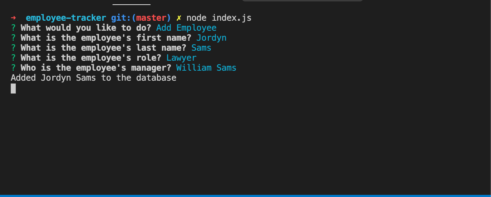

## Company Database

THis application will allow users to add/view departments, roles, employees! All from the command line! 

## Table of contents

- [User-Story](#User-Story)
- [Key-Tools](#Key-Tools)
- [Useage](#Useage)
- [Images](#Images)

## User-Story

As a business owner

I want to be able to view and manage the departments, roles, and employees in my company

So that I can organize and plan my business

## Key-Tools
-MySQL
-Inquirer
-console.table

## Images

